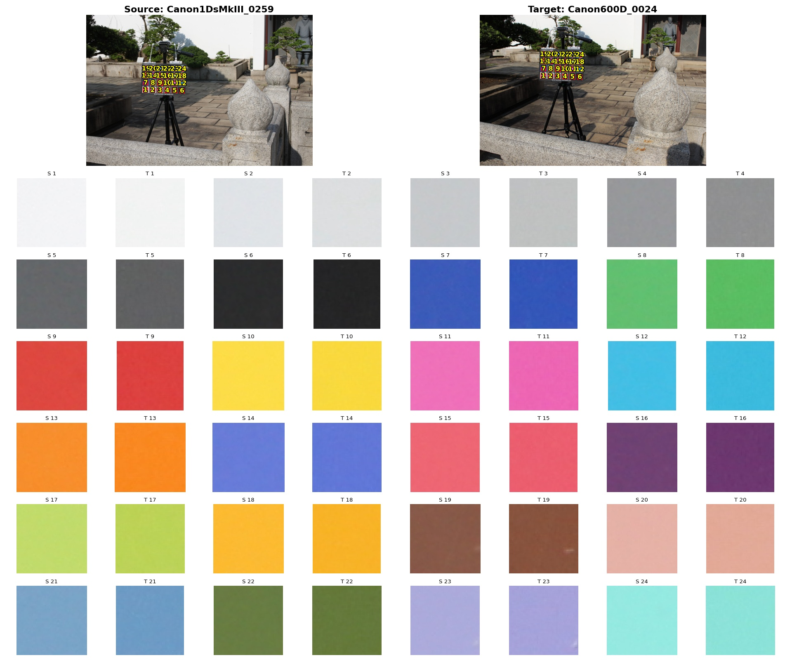
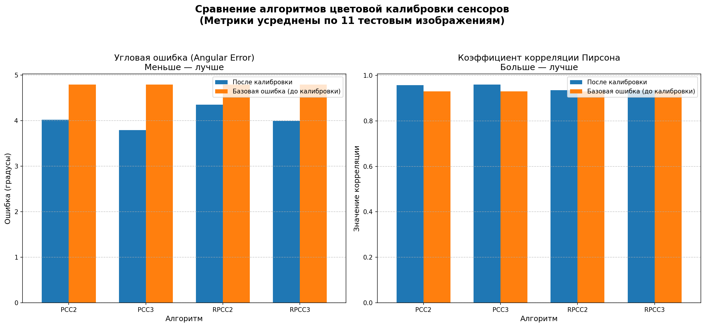
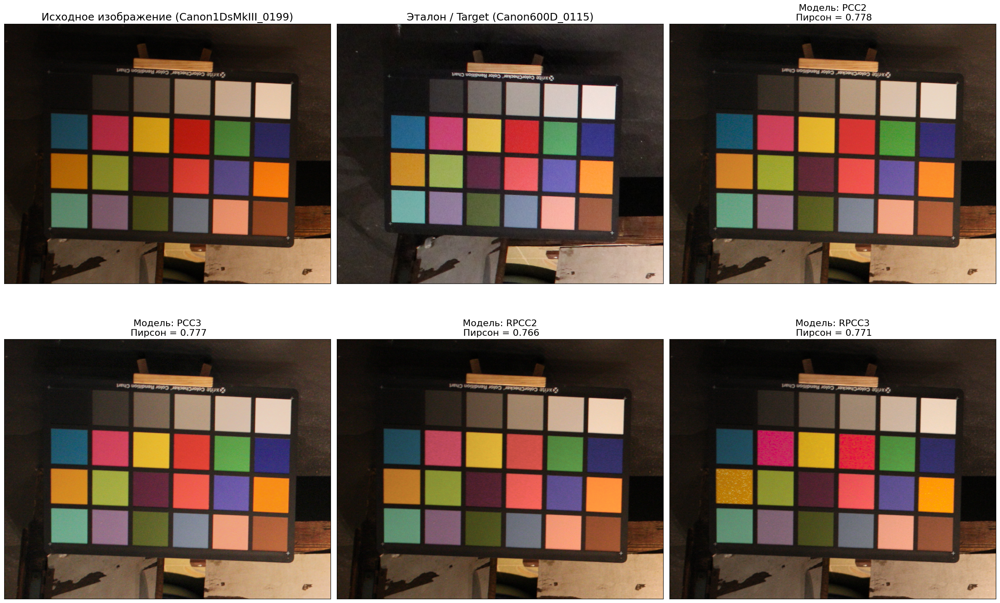

# Калибровка цветового сенсора

Данный репозиторий содержит лабораторную работу по калибровке цветовых сенсоров цифровых камер на основе полиномиальной (PCC) и корневой полиномиальной (RPCC) регрессии. 

## Описание задачи

Задача цветовой калибровки заключается в нахождении оптимального математического преобразования между цветовыми пространствами двух разных физических сенсоров. В данном эксперименте выполняется перевод из пространства камеры-источника (**Canon EOS-1Ds Mark III**) в пространство целевой камеры (**Canon EOS 600D**).

Для нахождения матрицы преобразования $M$ размера $3 \times n$ используется метод наименьших квадратов (МНК), минимизирующий евклидово расстояние между предсказанными пикселями и эталоном в линейном цветовом пространстве. Перед вычислением матриц выполняется обязательная линеаризация данных из нелинейного sRGB пространства с помощью преобразования `sRGB2Lin`.

---

## Предобработка и фильтрация датасета

Исходный открытый набор данных (NUS 8-Camera Dataset) содержит значительное количество шума в разметке и рассинхронизацию по сценам, что критически искажает обучение моделей. В рамках работы был реализован конвейер массового визуального сопоставления (разметки) сцен с двух камер и очистки данных.

### Основные этапы фильтрации:
1. **Синхронизация сцен (маппинг пар):** Обнаружено, что нумерация кадров у камер не совпадает (например, сцена в раздевалке у одной камеры и сцена в кабинете у другой имели одинаковый индекс `0001`). С помощью автоматизированного скрипта генерации коллажей были вручную отобраны и жестко зафиксированы в конфигурационном файле `dataset_config.json` только истинно парные изображения с идентичным освещением. Были учтены сдвиги индексов (offset shift), например, пара `0239 -> 0004` и далее по порядку.
2. **Умный поворот (Smart Rotation):** В датасете часть цветовых мишеней зафиксирована вверх ногами. Алгоритм автоматически вычисляет средние Y-координаты первого (темно-коричневого) и 24-го (черного) патчей по файлам разметки `mask.txt`. Если координата первого патча больше, изображение автоматически разворачивается на 180 градусов (`crop[::-1, ::-1, :]`), гарантируя правильный порядок считывания патчей.
3. **Исключение дефектной разметки:** В процессе были выявлены и полностью удалены дефектные сэмплы с битой или смещенной геометрией масок (например, пара кадров `220 -> 136`).

Пример того, как производилась проверка разметки:

---

## Результаты экспериментов

Ниже представлены итоговые численные метрики, полученные на очищенном, сбалансированном и линеаризованном датасете. Оценка качества моделей проводилась по двум метрикам: средней угловой ошибке (Angular Error, в градусах) и коэффициенту линейной корреляции Пирсона. Тестирование выполнено на независимой отложенной выборке (43 пары на обучении, 11 на тесте).

| Модель калибровки | Ошибка после калибровки (Angle, °) | Корреляция после калибровки (Pearson) | Базовая ошибка до калибровки (Angle, °) | Базовая корреляция до калибровки (Pearson) |
| :--- | :---: | :---: | :---: | :---: |
| **PCC 2-го порядка** (PCC2)  | 4.023588 | 0.956732 | 4.790533 | 0.930393 |
| **PCC 3-го порядка** (PCC3)  | **3.790518** | **0.959141** | 4.790533 | 0.930393 |
| **RPCC 2-го порядка** (RPCC2) | 4.354301 | 0.934954 | 4.790533 | 0.930393 |
| **RPCC 3-го порядка** (RPCC3) | 3.996018 | 0.935144 | 4.790533 | 0.930393 |

### Графическое сравнение метрик:

---

## Анализ результатов и выводы

**Почему обычный PCC оказался лучше, чем RPCC?** * Алгоритм корневых полиномов Финлейсона (RPCC) математически спроектирован так, чтобы быть устойчивым к  изменениям экспозиции и выдержки (Scale-Invariance). 
   * Поскольку в рамках предобработки мы составили строго парные сцены с идентичными условиями съемки и яркости на обеих камеры похожи, то RPCC оказался не таким невостребованным. 

### Пример визуализации калибровки на тестовом кадре:

---

## Структура проекта

* `main.py` — основной исполняемый скрипт (разбиение выборки, обучение МНК, расчет метрик и построение графиков).
* `dataset_processing.py` — модуль сборки датасета, усреднения цветов патчей и линеаризации `sRGB2Lin`.
* `CST.py` — математическая реализация расширения признаковых пространств для моделей PCC2/PCC3/RPCC2/RPCC3.
* `metrics.py` — расчет угловой ошибки векторов и коэффициента Пирсона.
* `constants.py` — конфигурация базовых директорий и списков моделей.
* `dataset_config.json` — JSON-конфигурация валидированных парных индексов сцен.
